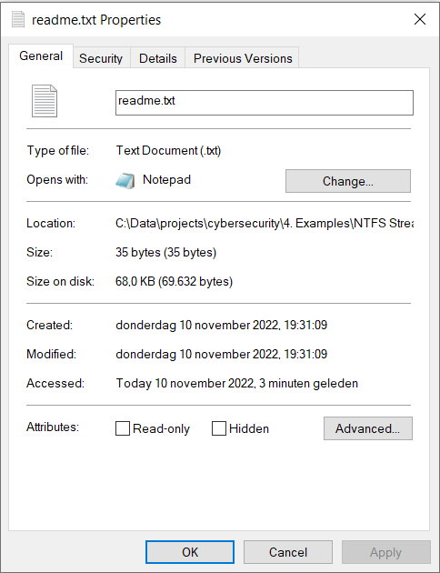

# Hide malicious data using NTFS Streaming
_Maurice Snoeren, 10 November 2022_

A lot of attacks are based on the limited knowledge of people. Attackers are trying to trick users to execute malicious activities while they think it is normal.

To demonstrate this, I would like to show the NTFS streaming functionality. Assuming that you are not aware of this functionality. Attackers can use this functionality to disguise their malicious files. Or you can hide all kind of secrets.

## Teaching instructions
* When showing this live in front of the classroom, please share the malicious readme.txt file to your students before hand.
* Before showing to reveal it, show the image that has been hidden as well: mspaint readme.txt:hacked
* WinRAR is able to maintain the stream, you can use readme.rar to get it to the students.

## Streaming
NTFS stream is a functionality of the NTFS file system. This is also known as alternate data streams (ADS). If you want to know more about this, you can read https://stealthbits.com/blog/ntfs-file-streams/. 

## Working
Suppose we have a malicious file "malicious.dat" we would like to hide on an NTFS file. This file can be anything, even an executed with malicious code. We could hide this malicious file in a seperate stream of the file readme.txt for example.

### 1. Create malicious.dat and readme.txt (Windows)
```
echo This is really malicious... > malicious.dat
echo Please read this readme.txt file > readme.txt
```

Checking if the file is created:
```
C:\>dir
10-11-2022  15:50    <DIR>          .
10-11-2022  15:50    <DIR>          ..
10-11-2022  15:49                30 malicious.dat
10-11-2022  16:10             1.463 README.md
10-11-2022  16:12                35 readme.txt

C:\>type malicious.dat
This is really malicious...

C:\>type readme.txt
Please read this readme.txt file
```

### 2. Hide the malicious file contents
Every file has a default stream and can have multiple streams. So we are going to create an alternative stream for the readme.txt file.

```
C:\>type malicious.dat > readme.txt:malicious
C:\>del malicious.dat
C:\>dir

10-11-2022  16:13    <DIR>          .
10-11-2022  16:13    <DIR>          ..
10-11-2022  16:10             1.463 README.md
10-11-2022  16:12                35 readme.txt
```

You see that malicious.dat is removed and that the readme.txt file still has the same bytes (35)! The malicious file is still there and available to be used for attacks.

### 3. Use malicious file
So, how to use the malicious file now? We will first read the content of the readme.txt and after that we will get the malicious.dat content by using the stream.

```
C:\>more < readme.txt
Please read this readme.txt file

C:\>more < readme.txt:malicious
This is really malicious...
```

See, it still exists.

### 4. A last check!
Please copy the readme.txt file to a different location! It is important that you copy it to a location that is also using NTFS. When you have copied it, please retry the command in the previous section.

```
C:\OtherLocation>dir readme.txt

10-11-2022  16:12                35 readme.txt

C:\OtherLocation>more < readme.txt
Please read this readme.txt file

C:\OtherLocation>more < readme.txt:malicious
This is really malicious...
```

Really?! The malicious stream is still there to be used even it is copied to a different location. It is not detected by normal users and the ```dir``` commands.

## Reveal streams!
It is possible to reveal the stream. Try out the following command.

```
C:\>dir/R readme.txt

10-11-2022  16:12   35 readme.txt
                    30 readme.txt:malicious:$DATA
```

You can also see it when you opened the details of the file using Windows explorer. __do you see it?__



At this moment, you will see the assiocated stream of the readme.txt file. So, it really exist. If you do not know this, you can easily be tricked!

